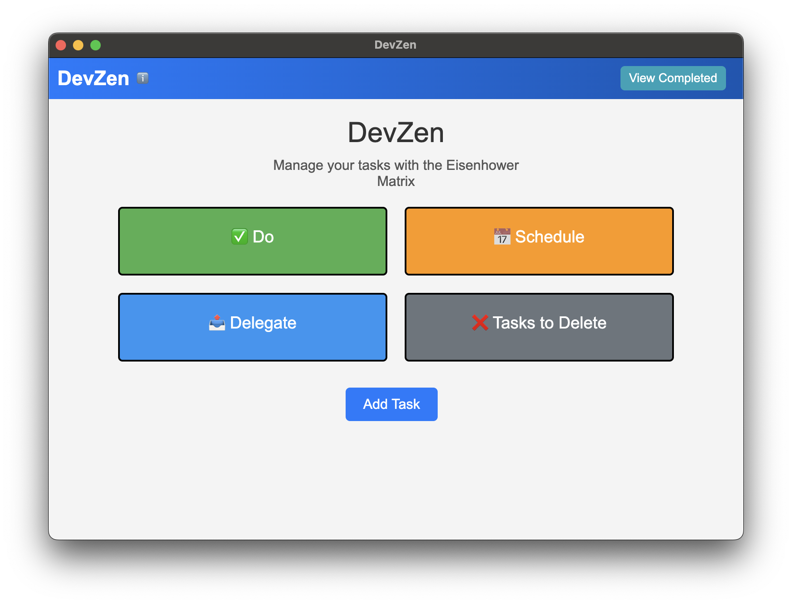

# Team 07 - CSE 210 Fall 2024

# DevZen

DevZen is a developer productivity tool designed to streamline task management using the Eisenhower matrix. With a sleek desktop app, DevZen allows you to effectively prioritize, manage, and complete tasks with ease. Boost your productivity and stay organized with features tailored for developers.

---

## Eisenhower Matrix View

A preview of the app’s Eisenhower matrix. 

---

## Further Insights

- [Product Reel](https://youtu.be/szam5nk1-ro) - See our product in its full glory!
- [Technical Video](https://youtu.be/a37a69_dwis) - A technical deep dive into our project.
- [Team Learnings Retrospective](https://youtu.be/UHh3gXRNoPw) - A reflection on what we learnt through this project!

---

## Features

### ✨ Task Management Made Simple
- **Edit Tasks:** Modify your tasks quickly and easily to adapt to changing priorities.
- **Markdown Notes:** Add detailed notes using Markdown syntax to enrich your tasks.
- **View Completed Tasks:** Keep track of your achievements with a dedicated view for completed tasks.
- **Set Deadlines:** Stay on top of your schedule by assigning deadlines to tasks.
- **Hotkey Access:** Instantly open DevZen with a customizable global shortcut.

### 🔨 Built for Developers
- **Cross-Platform Compatibility:** DevZen runs seamlessly on Windows and MacOS. **Note:** We did not develop for Linux due to build issues with Electron Forge.
- **Eisenhower Matrix:** Organize tasks into quadrants based on urgency and importance for smarter prioritization.
- **Customizable Views:** Tailor your interface to suit your workflow.

---

## Installation and Setup

### Install Dependencies
```bash
cd application
npm install 
```

### Run the Application in Development Mode
```bash
cd application
npm run start
```

### Build the Application Executable
#### For Current Platform
```bash
cd application
npm run make
```
#### For MacOS
```bash
cd application
npm run make --platform darwin
```
#### For Windows
```bash
cd path/to/application
npm run make --platform win32
```

---

## Global Shortcut

When the app is running, you can quickly open it using:

- **Windows:** `Ctrl + Alt + T`
- **MacOS:** `Command + Option + T`

These hotkeys are customizable from the app settings.

---

## Code Versions

### Main Branch
[`main`](https://github.com/Team-07-CSE-210-FA-24/cse210-fa24-group07/tree/main) - The main development branch contains the latest features and updates.

### Release Branch
[`final-release`](https://github.com/Team-07-CSE-210-FA-24/cse210-fa24-group07/tree/final-release) - The release branch contains stable, production-ready versions, and some post code-freeze improvements.

---

## Documentation
Documentation can be found in the [`application/documentation`](https://github.com/Team-07-CSE-210-FA-24/cse210-fa24-group07/tree/main/application/documentation) directory.

---

## Project Board

[View Project Board](https://github.com/orgs/Team-07-CSE-210-FA-24/projects/2) - Track our development progress and upcoming features on the project board.

---

## License
DevZen is developed as part of the **CSE 210 Fall 2024 Project for Team-07**.

---

Download and supercharge your productivity today!
