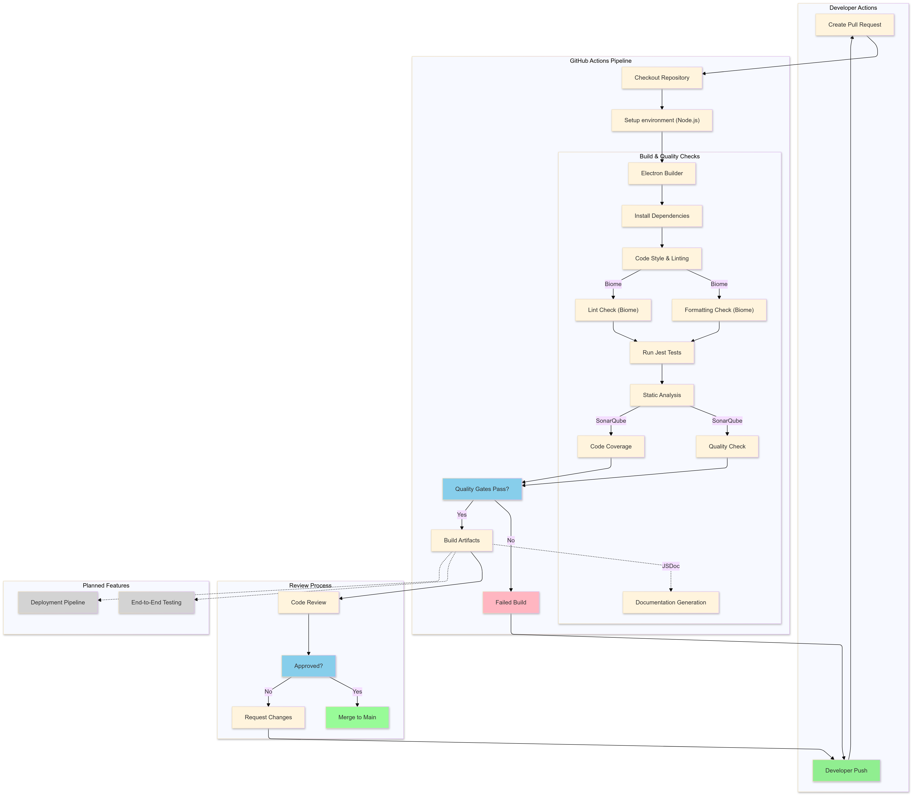

# CSE 210 Group 7 - CI/CD Pipeline

Following is a detailed description about the CI/CD pipeline setup, design decisions, and current status. The pipeline is being built and tested on the [`CI_CD_Pipeline`](https://github.com/ishanppendse/cse210-fa24-group07/tree/CI_CD_Pipeline) branch of the project repo. The CI/CD Pipeline has been set up using GitHub actions, and is ready barring some bugs that we need to fix.

Following is a visual representation of the pipeline 

## Linting and Code Style Enforcement: Biome
### Proposed Tool
We chose [Biome](https://biomejs.dev/) for linting and formatting and set up EditorConfig to unify indentation configs.  

### Considered Options
1. [Prettier:](https://prettier.io/) An opinionated code formatter.
2. [ESLint:](https://eslint.org/) A linting tool for JavaScript.
3. [Biome:](https://biomejs.dev/) A new formatting and linting tool.
4. [EditorConfig:](https://editorconfig.org) A format for configuring basic styles such as indent size and whether to use tabs or spaces.

### Decision Outcome
We chose Biome with EditorConfig integration because:
- **Unified Code Style:** Using Biome simplifies the workflow by combining linting and formatting into a single tool, reducing the overhead of managing multiple configurations.
- **Performance Advantages:** Biome is written in Rust, offering better performance and faster execution compared to JavaScript-based tools like ESLint and Prettier.
- **Editor Support:** EditorConfig ensures that editor settings like indentation and tab preferences are automatically configured across popular IDEs such as Webstorm and VSCode.
- **Modern Features:** Biome provides state-of-the-art features, including support for modern JavaScript and TypeScript, making it future-proof for our evolving codebase.

### Current Status
The formatting and linting step is fully integrated into the pipeline and runs before unit testing. All prior formatting inconsistencies have been fixed.

## Code Quality Tool: SonarQube
### Proposed Tool
We proposed using SonarQube as our code quality tool.

### Considered Options
- **Code Climate:** Focused on maintainability and test coverage.
- **Codacy:** Offers comprehensive automated code reviews but lacks deep customization.
- **SonarQube:** A robust tool for code quality and security analysis with advanced integration features.

### Decision Outcome
We chose SonarQube because:
1. **Comprehensive Analysis:** SonarQube offers detailed metrics like code smells, bugs, and vulnerabilities, which align well with our goal of maintaining a high-quality codebase.
2. **Customizability:** Unlike Codacy, SonarQube provides flexible configuration options, enabling us to define quality gates tailored to our project.
3. **Self-Hosting Capabilities:** SonarQube supports self-hosting, allowing us to maintain control over the data and configurations while running locally.
4. **Feedback Loop:** Integration with GitHub Actions allows developers to receive actionable feedback on pull requests, promoting better collaboration and faster resolution of issues.

### Current Status
The integration of SonarQube into the pipeline is partially functional and includes:
1. **Project Configuration:** A configured `sonar-project.properties` file for the self-hosted instance.
2. **Quality Gates:** Key metrics like code coverage and code smells are monitored.
3. **Pipeline Integration:** Automatic analysis on pull requests using GitHub Actions.
4. **Dashboard Feedback:** The SonarQube dashboard is live at [http://localhost:9000](http://localhost:9000) but requires further configuration for branch-specific integration.

## Unit Tests via Automation: Jest
### Proposed Tool
We chose Jest for automated unit testing.

### Considered Options
1. [Jest:](https://jestjs.io) A comprehensive JavaScript testing framework with built-in support for unit, integration, and snapshot testing.
2. [Mocha:](https://mochajs.org) An extendable framework for unit and integration testing.
3. [Cypress:](https://www.cypress.io) An end-to-end test framework.
4. [QUnit:](https://qunitjs.com) A test framework maintained by the jQuery project.
5. [Enzyme:](https://enzymejs.github.io/enzyme/) A test framework designed specifically for React.

### Decision Outcome
We chose Jest because:
1. **Ease of Use:** Our team has prior experience with Jest, which minimizes the learning curve and accelerates adoption.
2. **Integrated Features:** Jest provides built-in support for mocking, snapshot testing, and code coverage reporting, reducing the need for additional tools.
3. **Performance:** Parallel testing is natively supported in Jest, enabling faster test execution compared to Mocha.
4. **Wide Adoption:** Jest is widely adopted and actively maintained, ensuring robust community support and regular updates.

### Current Status
Jest is fully integrated into the pipeline. Unit tests run automatically on every commit, ensuring continuous validation of code changes.

## Document Generation via Automation: JSDoc
### Proposed Tool
We chose JSDoc for enhancing maintainability and readability.

### Considered Options
- [JSDoc:](https://jsdoc.app) Provides detailed in-code documentation and integrates well with IDEs.
- [TypeDoc:](https://typedoc.org) A tool for generating TypeScript documentation but requires significant configuration for JavaScript projects.
- [Docco:](http://ashkenas.com/docco/) Focuses on generating literate programming-style documentation but lacks inline IDE integration.

### Decision Outcome
We chose JSDoc because:
1. **Developer Productivity:** JSDoc integrates with popular IDEs like VSCode, providing inline documentation that improves code readability and maintainability.
2. **Flexibility:** JSDoc supports both JavaScript and TypeScript, making it suitable for our mixed-codebase.
3. **Automation:** It seamlessly integrates with our CI/CD pipeline, automatically generating documentation as part of the build process.

### Current Status
JSDoc is fully functional and integrated into the repository. Usage instructions are available in the [README](https://github.com/ishanppendse/cse210-fa24-group07/blob/CI_CD_Pipeline/README.md), enabling developers to easily generate and view documentation.